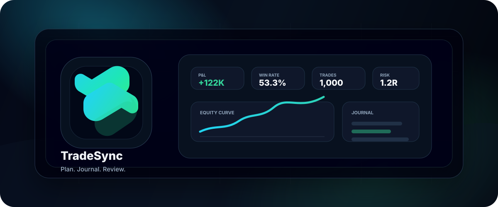
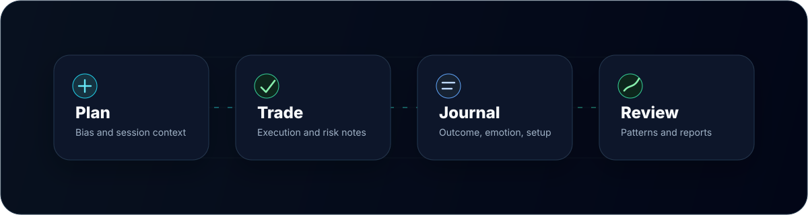
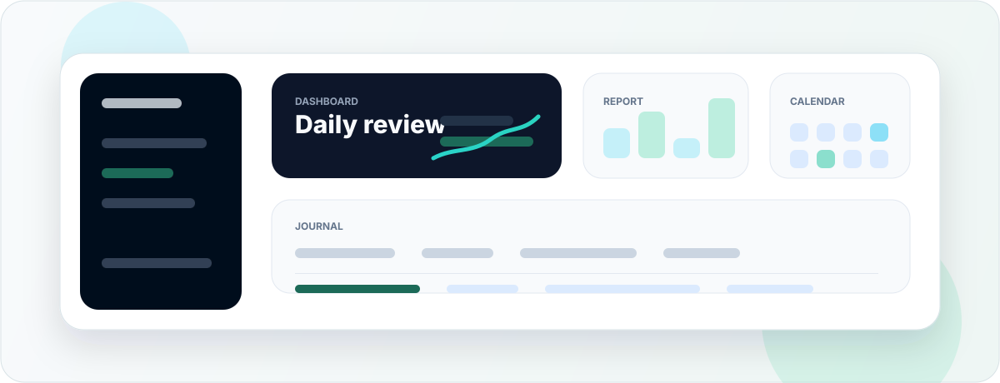

 

# TradeSync

**A discretionary trading journal for traders who plan, trade, and review with data.**

Plan the trade, trade the plan, journal the outcome.

 

---

  

---

## What TradeSync helps you do

  

 

<table>
  <tr>
    <td width="50%"><strong>Journal every trade</strong> Log entries, exits, risk, notes, setups, and emotions in one place.</td>
    <td width="50%"><strong>Review performance</strong> Track equity, monthly P&amp;L, win rate, best symbols, and setup performance.</td>
  </tr>
  <tr>
    <td width="50%"><strong>Plan before the session</strong> Write daily bias, points of interest, and session context before taking a trade.</td>
    <td width="50%"><strong>Share without exposing the account</strong> Turn selected trades, reports, or daily performance into public cards.</td>
  </tr>
  <tr>
    <td width="50%"><strong>Keep accounts separate</strong> Organize personal, funded, and paper accounts without mixing their history.</td>
    <td width="50%"><strong>Work in your language</strong> Use TradeSync in English, Vietnamese, Japanese, Korean, or Chinese.</td>
  </tr>
</table>

---

## Highlights

> TradeSync is built around a simple loop: write the plan, take the trade, record the outcome, and review the pattern.

- **Journal filters that stay readable.** Quickly narrow trades by symbol, side, status, setup, result, saved preset, or date range.
- **Reports built for review sessions.** Scan equity, monthly P&L, setup performance, top symbols, and trade distribution from one reporting surface.
- **Calendar context.** Spot strong days, weak weeks, and missing sessions without reading through every row.
- **Share-ready snapshots.** Turn selected trading moments into public cards without exposing private account data.

---

## Privacy by default

- Data is stored in the EU region.
- Account data is isolated per user.
- No advertising or remarketing cookies.
- Users can export and delete their data from the app.

Read the full [privacy policy](https://tradesynchub.app/privacy).

---

## Get started

1. Open [tradesynchub.app](https://tradesynchub.app/).
2. Create an account.
3. Log your first trade.
4. Review the result and build the daily ritual.

---

## Support

[Report a bug](https://github.com/phankietit/tradesync-hub/issues/new?template=bug.yml) ·
[Request a feature](https://github.com/phankietit/tradesync-hub/issues/new?template=feature.yml) ·
[Ask a question](https://github.com/phankietit/tradesync-hub/issues/new?template=question.yml)

For direct support: [tradesynchub.app@gmail.com](mailto:tradesynchub.app@gmail.com)

---

Documentation in this repository is licensed under [CC-BY-4.0](LICENSE).

No source code is published in this repository.

